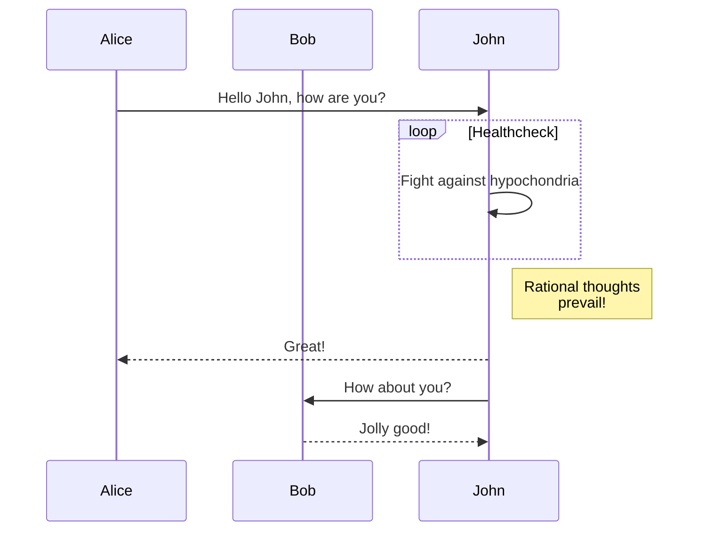

Hugo ships with several [Built-in Shortcodes](https://gohugo.io/content-management/shortcodes/#use-hugos-built-in-shortcodes) for rich content, along with a [Privacy Config](https://gohugo.io/about/hugo-and-gdpr/) and a set of Simple Shortcodes that enable static and no-JS versions of various social media embeds.
<!--more-->
---

## YouTube Privacy Enhanced Shortcode



 

---

## Twitter Simple Shortcode



 

---

## Vimeo Simple Shortcode



 

---

## Mermaid

